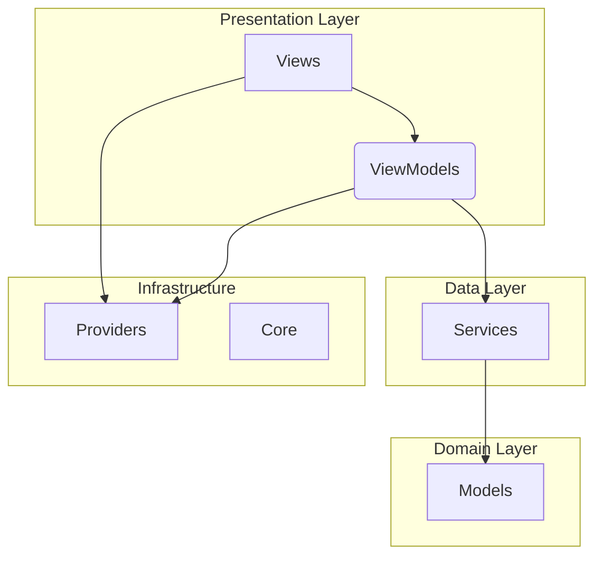

# Modification Design: State Management Migration to Riverpod

## Overview

This document outlines the design for migrating the state management of the JobHub mobile application from `provider` and `get` to `riverpod`. The migration will adhere to the standards and best practices defined in the `GEMINI.md` file, ensuring a clean, maintainable, and scalable architecture.

## Detailed Analysis of the Goal or Problem

The current implementation of the application utilizes two different state management libraries: `provider` and `get`. This creates an inconsistent and fragmented state management approach, making the codebase harder to understand, maintain, and scale. The goal is to unify the state management under a single, modern, and powerful solution: Riverpod.

The `GEMINI.md` file explicitly states that only Riverpod should be used for state management, with a strict set of allowed providers (`FutureProvider`, `StreamProvider`, and `NotifierProvider`). The current implementation violates this rule.

The migration will involve:

1.  **Removing `provider` and `get`:** All dependencies on `provider` and `get` will be removed from the `pubspec.yaml` file and the codebase.
2.  **Introducing `riverpod`:** The `flutter_riverpod` package will be added as a dependency.
3.  **Refactoring existing code:** All existing state management logic will be refactored to use Riverpod providers.
4.  **Restructuring the project:** The project will be restructured to follow the folder structure defined in `GEMINI.md` for providers, but the MVVM pattern will not be strictly enforced for existing controllers as per user instruction.

## Deviation from MVVM

As per user instruction, the MVVM pattern was not strictly enforced during this migration. The existing `controllers` folder was retained, and new Riverpod notifiers were placed there. The `viewmodels` folder was not created, and existing UI files were not refactored into `views/pages` and `views/components`. This deviation was made to focus solely on the Riverpod/state management changes.

## Alternatives Considered

The user has explicitly requested to use Riverpod for state management, so no other alternatives were considered.

## Detailed Design

The migration will be performed in a phased approach, focusing on one feature at a time to minimize disruption and ensure a smooth transition.

### 1. Project Setup

1.  **Add `flutter_riverpod` dependency:**
    ```yaml
    dependencies:
      flutter_riverpod: ^2.5.1
    ```
2.  **Remove `provider` and `get` dependencies:**
    ```yaml
    dependencies:
      # provider: ^6.0.5
      # get: ^4.6.5
    ```
3.  **Update `main.dart`:**
    The `main.dart` file will be updated to wrap the root widget with a `ProviderScope`.

    ```dart
    import 'package:flutter/material.dart';
    import 'package:flutter_riverpod/flutter_riverpod.dart';
    // ... other imports

    void main() {
      runApp(
        const ProviderScope(
          child: MyApp(),
        ),
      );
    }
    ```

### 2. Folder Structure

The project will be restructured to follow the MVVM pattern and the folder structure defined in `GEMINI.md`:

```
lib/
├── models/
├── views/
│   ├── pages/
│   └── components/
├── viewmodels/
├── services/
├── providers/
├── core/
└── main.dart
```

### 3. Riverpod Implementation

The existing state management logic will be refactored to use the following Riverpod providers:

*   **`FutureProvider`:** For asynchronous operations that return a single value, such as fetching data from an API.
*   **`StreamProvider`:** For continuous data streams, such as listening to a WebSocket or a Firestore collection.
*   **`NotifierProvider`:** For mutable state management, such as managing user input or the state of a UI component.

#### Example: Migrating a `ChangeNotifierProvider` to a `NotifierProvider`

**Before (Provider):**

```dart
// controllers/login_provider.dart
class LoginNotifier extends ChangeNotifier {
  // ... business logic
}

// main.dart
ChangeNotifierProvider(create: (context) => LoginNotifier()),
```

**After (Riverpod):**

```dart
// viewmodels/login_viewmodel.dart
import 'package:flutter_riverpod/flutter_riverpod.dart';

class LoginViewModel extends Notifier<void> {
  @override
  void build() {
    // return initial state
  }
  // ... business logic
}

// providers/auth_providers.dart
import 'package:flutter_riverpod/flutter_riverpod.dart';
import 'package:jobhub_mobile/viewmodels/login_viewmodel.dart';

final loginViewModelProvider = NotifierProvider<LoginViewModel, void>(() {
  return LoginViewModel();
});
```

### 4. Mermaid Diagram

The following diagram illustrates the proposed Riverpod architecture:



## Summary of the Design

The proposed design will unify the state management of the application under Riverpod, following the standards and best practices defined in `GEMINI.md`. This will result in a more consistent, maintainable, and scalable codebase. The migration will be performed in a phased approach to minimize disruption and ensure a smooth transition.

## References

*   [Riverpod Documentation](https://riverpod.dev/)
*   [Flutter Riverpod Package](https://pub.dev/packages/flutter_riverpod)
